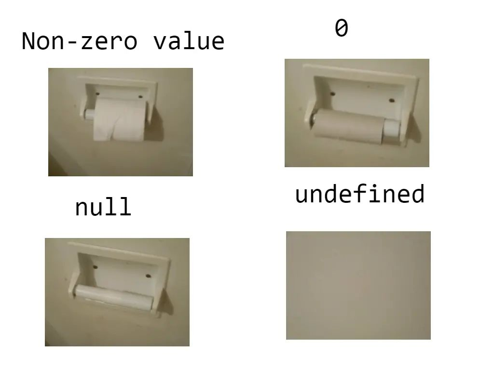

# 2022 年终总结

## Abstract

泡在疫情和网课的近一整年 学了又没全学 摆了又没全摆的一整年 离目标的自己没近没远的一整年 明年会是什么样 能学到多少东西 能接触多少新方向 认识多少新面孔 真正掌握并融会贯通多少东西 不太清楚 应该仔细想一下 一年到底都干什么了 今年给我的感觉就是 **好像没过**

回归自由的一整年 泡在疫情和网课的近一整年 学了又没全学 摆了又没全摆的一整年 离目标的自己没近没远的一整年 明年会是什么样 能学到多少东西 能接触多少新方向 认识多少新面孔 真正掌握并融会贯通多少东西 不太清楚

## Freedom

自2021/11/28之后重回所谓自由 这一年给我的感觉就是 前期还是有诸多的不适应和幻想可言的 后来就根本没有了 然后这一年可以说没有任何的交流 如果不是需要总结一下这一年发生什么了 是不需要再提起这件事 换种说法是想不起来这件事情的 然后就是 随便怎么说 今年的我在各种能效或者配置方面已经完全胜过去年的我了 就像那天发的一篇 “我再没有把自己折磨成那个鬼样子 相反还收获了很多” 也许并没有真正收获多少 但总是有收获的 也就是说 这可以作为我认为的 一次正常且正确的决定 从明年开始 也就不会再提起这件事情了 并不希望她变得多好 或者说也是因为这个人的存在 分神了我本该内卷的时候的经历 也早就如今并不扎实基础的我 这不是什么好事 没有了 现在已经完全不在意自己的各种形象了 是好事也不是好事 反正 活着很开心 不要为别人活着也不要舔 自己挺好的

## The Last COVID Year

新十条之后 "疫情"也就结束了 三年前还在要高考的疫情 现在基本上还在羊 但已经没人去关注了 以后会变成什么样 至少现在还不知道 身边一个接一个羊一个接一个杨康或者再羊一次 理论上来说今年应该是新冠最后一年了 但明年还会有羊这是一定的 但还是记录一下 三年时间 最后一个这样的结果 我不好评价了 不管怎么说 这也是人类历史上的一次记录 人类对于自然的较量 也不算是较量 应该是接收自然的惩罚 或者自食其果 我也不太清楚这个伦理应该怎么说明 总之希望以后的日子可以变得好一点

## Academic

上学期拿了二等奖学金加一个维安 均绩90+ 自认为刚刚合格 在拿钱方面对自己的要求也就到这了 不是很卷就是日常的学一学考前复习一下 跟那些平时不学考前突击的其实本质一样；在做技术方面 今年貌似没有收获什么实质性的东西 也就是说一些对于ARM底层的掌握还是只停留于表面 很多外设没有知其所以然 用起来就有点捉襟见肘 现在在看参考手册 但是觉得这样的学习方式也是有一定问题的 我需要再注意一下 看看怎么结合着学起来效果会更好一点 把外设的理念搞懂一点 一些需要接触寄存器的地方和Cube配置结合起来 然后一些已经可以直接用的底层驱动也可以先搞起来了 还有就是吉甲英雄也要搞一搞 每个模块的使用和调参 基于老代码但是也要自己缕一遍 在基础完全扎实的情况下 然后就是RTOS的使用 一些底层的接口也要知其所以然 最后做到灵活运动；在C++上也要下点功夫 至于为什么只能说需要用的到 然后一些理论的东西也很不扎实 关于DIP 无线通信 自控 或者其他感兴趣的方向 都只是不到一知半解的程度 看了书又好像没看 也不是很清楚应该怎么用 和以后读研可能方向会重叠有可能不会 到现在还没确切定下来哪个分支 考也是电子信息或者信通 代码基础也不是很扎实 专业课能力也比较一般 做电路也只停留在仿真和简单堆模块层面 32开发也是猛猛调API 至于一些深度学习的东西 就是抄抄开源 简单复现一下 底层的一些东西都不是很懂 感觉调API不如自己了解底层 然后给我的感觉就是 有的时候调API是挺舒服的事情 有的时候又不是 当然这基于这个接口是不是由我亲自封装或者我用的是否熟练 表现为他的底层逻辑我是否理解 就比如说一些串口的传输函数 我用的足够多就可以比较方灵活地使用 但直到刚才我才比较完整且仔细的重温了一遍底层的寄存器 一些基于寄存器的字节操作 或者一些看起来有点怪的方式我才比较好的进行了重新的了解 包括电机的驱动 忙活了一年直流编码器电机我到现在都还没有很确切的说我非常熟练的掌握了 相比之下设计电路、贴片焊接、编写驱动程序这些看起来应该很轻松的事情在我这都变得有些难度了 以至于我驱动了一个OLED都觉得也算是一步成功 实在是非常的可笑的一件事 然后就是其他方面的学习 这学期的功课学的并不是很扎实 感觉就是很水的过完了一整学期 收获了但没有完全收获 接触的东西可以说挺好也可以说没那么好

> 2022/12/22 

接着昨天的写 然后今天要搞得 是考研了 相较于搞那些东西 感觉把研究生考到手是比较实在的一件事 毕竟我的能力我自己比较清楚 能够获得一个比较好的未来 还是需要不停地复习不断地考试通过书本知识来获取这方面的地位的 然后至于课外的东西 每周给自己留出来一到两天的时间猛猛搞 也争取通过这种方式比较好的进一步不落下我之前的东西 计划已经订好了 该制备的教材也已经差不多了 这几天就把手头的工作做一个快速的收尾 之后就安心的准备考研 每周复习5-6天 每天7-9个小时的比较高效的复习方式 一直持续到过年 年后准备期末考试和考研并行 然后开学一边认真准备课内的课程一边扎实考研 猛猛复习 目前是这么规划的 然后相关笔记的补充 先以数字电路为侧重点 信号当然也不会落下 最主要的是英语的复习 这是明年一整年需要比较好的落实的一件大事！！能不能成功就看明年一年到底复习成什么样子了 不要摆烂

## Forward

"向前看" 是这样的 至于说怎么走以后的路 我的人生会活成一个什么样的状态自己还不是比较清楚地 最主要的是个人对于一个轻重的理解 或者说我到底应该成为一个什么样的人比较适合我自己 不管怎样 我还是有那么一点收获的 

##	ACG

不论怎么说 今年可以作为本人的ACE元年 之前有所接触但是不是很深入 属于入门层；后续通过不断地接触并深入了解，逐渐提纯至如今的程度 两次比较大的提纯分为位于4-5月份以及7-8月份 4-5月份属于揽旧追新，双线程般猛猛追，更多地还是旧作品的预习；7-8月份值暑假 自然是一边提纯一边继续看老作品 品味那些所谓的“经典”事实上也确实是经典之作 某种程度上也为我的主流方向定了基调；至下半年后 由于各方面的事情要忙 集中补番的时间就变得很少 这段时间也主要是漫画和新番为主；12月初由于放假回家也有了时间补了两部比较经典的 也算是一种""考前突击"吧 在短期时间内我还会继续沉迷其中 至少浓度会只增不减；然后歌单的话也是猛猛转向 从去年的国风古风到现在的ACE霸屏 猛猛提纯了属于是 之后的时间感觉这个兴趣是没有什么问题的 对我来说也算是一种排解的方式 

## Summary

准确来说 今年一年也没有什么比较实质性的收获 自己所掌握的东西还是感觉很薄弱 不管哪个方向都是浅尝辄止 一边展望未来一边往前赶 还是挺失败的人生

## Wishes

其实年终总结 今年过得挺快的 没感觉到有什么变化和去年 几次网课把每一天都变得很单调很无趣 每天重复同一件事的话 自然是没有什么可以纪念的东西 但也可以说 今年见识了很多新面孔 结识了一些新朋友 学到了一些新东西(无论如何还是有一些的) 收获了一些新的观念(正面和反面都有) 努力了但没有完全努力 摆烂了但也没有完全摆烂 自我认知说好不太好说不好还行 总之 **不是一个比较正常的普通人 但可以说是一个比较普通的正常人吧** 然后希望新的一年 和去年一样的愿景 **2023 继续"停摆"**

> editor **scpsyl** 

​																																									——2022/12/30于中山
