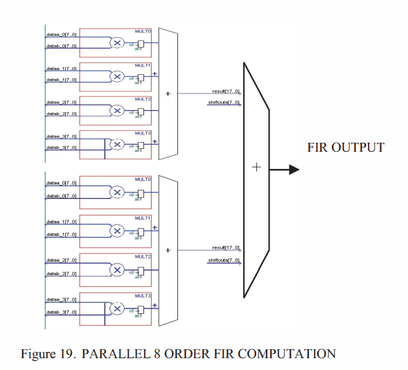

# 2023年终总结

## Abstract

更没有什么实质进展的一年 就好像”**被划过的一年**“

相较于去年有很多时间思考 今年没什么在思考 本篇是为了尽量维持完整性写的总结

## Curricular

去年的那几门课今年刚开学回来考的很烂 没一个过90的 然后下半年就没太怎么学习了 最后只水到了一个三等 加学术科技的三百块 但多申了一个贫困 加上考研给的补助 今年竟然收益有5k 还是比较爽的 本科的课程基本就到此结束了 选了比较水的FPGA做DSP的毕设 四年貌似就这么过去了

## Robomaster

上半年的大部分时间在做去年没有做完的rm比赛 结果很烂 准确而言我也没有做太多前台事件 只是把分给我的都做完了 没多做什么 也就没什么可以多说的 而后就没有再和下一届的相关队员有什么交集了 也可以说”水到奖了“ 比赛是六月份结束的 考研是七月份开始的

## the "Exam"

定了一个比较高的目标 然后就一直在准备考试了 上半年零散过了一遍数学 但没有什么实质性收获 加上有期末和比赛 就没太准备 是从7/1开始全力备考的 准确来说也不算多么”全力“ 只是把每一个精力充沛的时间拿来学习对应的课程了 现在还没出成绩 期望最后可以顺利上岸吧 还是很痛苦的 每次无意的回忆起那段时光 都会有好一阵苦痛涌上来

## Relax

考试是在12.24结束的 之后那几天就在玩了 去年因为疫情所以生活比较多姿多彩 很早就回来了 今年是12.31赶在2023年最后一天回的家 回家之后一直到现在也都是在摸鱼 每天睡得很长时间 就近玩了几天 打打游戏 锻炼一下 没看几篇文献 复试也还没怎么准备 实习也打算年后再去 还是比较摆的 用着新装的主机 过着神仙日子 不过也应该到头了

## Summary

因考研被划去的半年 并且前半年没有任何实质性收获  加之生理和心理被折磨的挺累的 总之延续了本就失败的人生

## Wishes

当下最希望的就是**上岸成功** 其次是**毕设顺利完成** 把该做好的东西做好 再就是把身体养好 多读一些书 多长一些见识 在已有的人生观基础上塑造的尽量更完善一点 说远一点的话 本科生活即将结束了 未来如风 希望能把自己的人生过得充实 在中年之时有所作为 暮年之时有所回味 直至去世那天 也可以在墓碑上刻下属于自己的墓志铭

* editor : scpsyl
* 2024/1/17于中山

