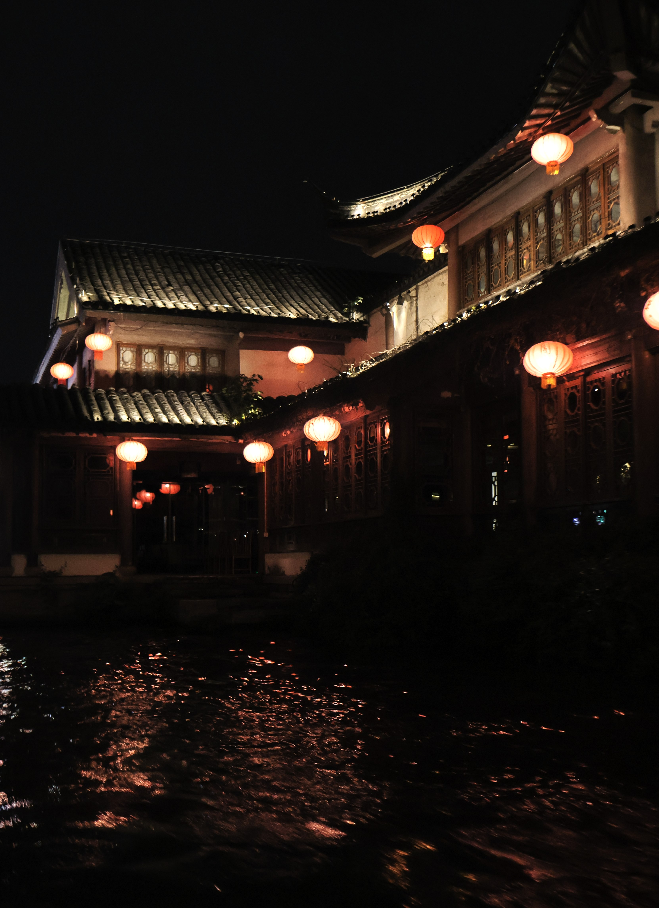
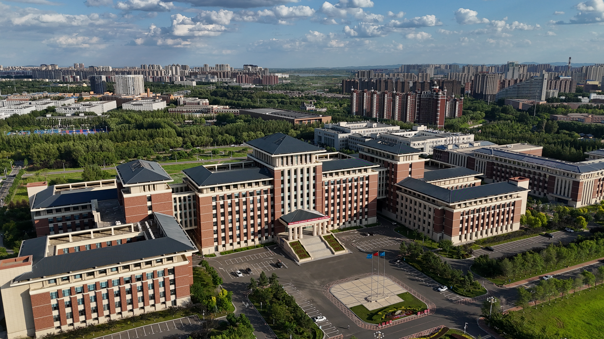
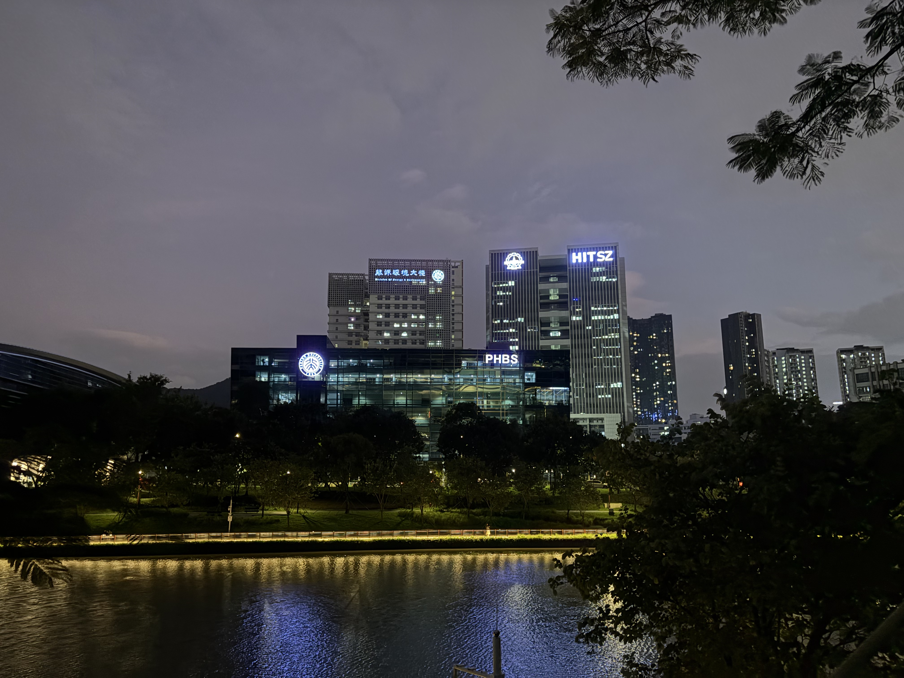

# Summary 2024

### Abstract

2024经历了很多事情，但还是觉得很快。相比于2023的空虚，今年确有很充实的。本来没打算写的 在2024最后一个小时回忆一下。

### Ending for B.s. Degree

首先是三月末的顺利上岸，这给我很大的鼓舞和激励，也在本科最后的阶段安心了很长时间。初试擦边进复试，复试又是一通拷打，出来的时候都要崩溃了，真没想到最后能上。。。然后收到上岸之后就舒服了很长时间，可以说那段时间是最无忧无虑的，甚至在畅想读研之后的生活，现在看来是多么的。。四月还去了北京小玩了几天，逛本部和隔壁，在未名湖畔拍天鹅，看清华园的荷塘月色。

之后是五月份的旅游，去了南京苏杭和上海，第一次去新的地方旅游，玩了一个月，见识到了书中的历史名胜，还买了单反，拍了很多好看的照片。第一次在南京坐秦淮游船，逛南京博物院，看那么多丰富的藏品，看到好多历史书和诗中的南京；第一次逛苏州园林，逛虎丘，那种精美的建筑还是很漂亮的；第一次游西湖，看三潭映月，看咫尺西天；第一次在上海逛外滩，好繁华啊，在百联线下买谷子，有一种从虚幻走向现实的感觉…逛华五高校，每所学校都有各自的风格和底蕴，这可能是作为学生的一大爱好吧。我是喜欢旅游喜欢拍照的，一直没有什么机会，这一个月确实是爽到了。

之后是六月的毕设结题，准确来说毕设我没做什么工作，被人喷我也懒得回嘴，本来还卷了卷工作量，奈何评委也不是很懂，问了一些奇奇怪怪的问题，最后也摆烂了，当时也只想着本科就这样也没什么，读研再说吧之类的。然后最后逛了逛长春，最后逛了逛吉大，回忆了我的四年。还是很感谢吉林大学的，没有JLU也不会有现在的我，不得不承认。就是现在，我也时常会回忆起我的这四年，从小镇什么都不会，只懂贪玩的小孩子，经过电子学院的培养和个人的定位，至有今日，令人慨叹。离别也没什么，大家都有新的事情要做，于是和实验室的朋友们分别，和室友分别，和过去的我分别，然后就回家了，收到通知书，就进组去了。

### Beginning M.s. in SIGS

这边的氛围还是不错的，但相对于本部还是少了很多学术浓厚和清华文化的熏陶，这不可避免。刚来的时候也时常自嘲“深专”之类的，但这边的老师，尤其是管理类的老师，总是对学生进行耳濡目染，时刻牢记自己作为清华人的责任，也是挺有意思的。深研院的认可度毋庸置疑，现在看来，我并不后悔当初的选择。

课题组那边，四五月份联系的老师，选了一个做机器人的课题组，但来了才知道其实不是纯做机器人的…七月中旬进组打了阵白工，现在也想不清楚是否正确。没干什么活，上来让我做SLAM和ROS的工作，上手倒是挺快，但我并不感兴趣。组里大多都是保研生，已经来了半年或一年了，和他们比我还是很菜的，这让我前几个月还是很郁郁的。后来还是步入正轨了，现在也有很多工作要做。

上半年选了很多课，忙的焦头烂额，各种作业，课题组这边的组会和进度，总之一大堆事情堆在一起，但也给我的能力确有提升。和师兄共事，听他们的教导，也能学到很多东西。一些学生思维的观念，也有了逐步的消退，对科研也有所qiemei（这两个字实在是不会打了hhh）但目前还没有一篇文章的产出，和个人能力也有关系，比较菜是这样的。然后就是能力方面确有提升，很多基本技能的上手，课题组也有不错的资源可以供我使用，还给配了不错的工作站，总之是比较美滋滋的。

生活方面，新室友人都很好，相处很融洽，行政班和本科没啥区别，还是谁都不认识谁，各有各的事情，我也觉得挺好的哈哈哈。离家很近，打车一个小时就到家了，以至于现在我也在家写，享受这一便利。

### Summary

越写越短哈哈哈，我觉得人在迷茫的时候是需要做很多总结的，而当你生活充实的时候，可能你并不太在意生活每天的点滴，实在让我回忆过去这一年，我觉得我最有成就感的事情就是：在正确的时间做了正确的决定，产生了很好的反馈，这也推动了我在之后有更好的正反馈循环。和去年相比，今年我可以说，**很充实的一年**，我的人生可以说不那么失败了。如果还有失败的地方，可能就是，我还是很菜哈哈哈，也找不到女朋友，对自己的形象也不在意，鼠的一批。

## Wishes

这个定位我觉得可以分很多来写，短期中期长期吧。

短期的话，可能还是在意个人发展，先实习看看，在企业里面做一些工作，体验一下上班的感觉，然后好好考虑一下到底是上班还是接着读博，其实现在也挺迷茫的，至少五年之后的规划还没想好。但一两年的规划还是很清楚的，主要还是产出和个人能力的提升，无论是申博还是工作，个人履历和实际能力都是硬通货，平台越高，给你用来模糊和水的空间就越少，也正是这样才是我一直读下去一直努力向上爬的动力。

长期的很模糊，这半年也参加了很多学术会议和论坛什么的，能见识到真正的大家、真正的强组，引领国内或者国际当前领域的一批人在做的工作，很是向往，但也深知自己还没有比肩的能力。

写到这刚好2025了，看着2023写的年终总结，那时的我有会看到今日的我吗，而明年的今天，那时的我，又会是什么样呢…

> editor: scpsyl
>
> 2024/12/31 于中山
