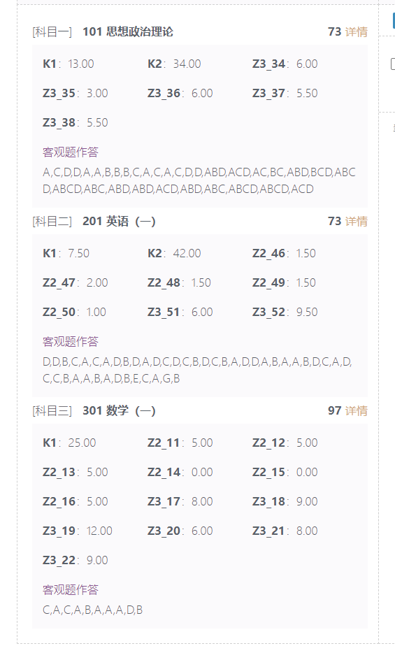
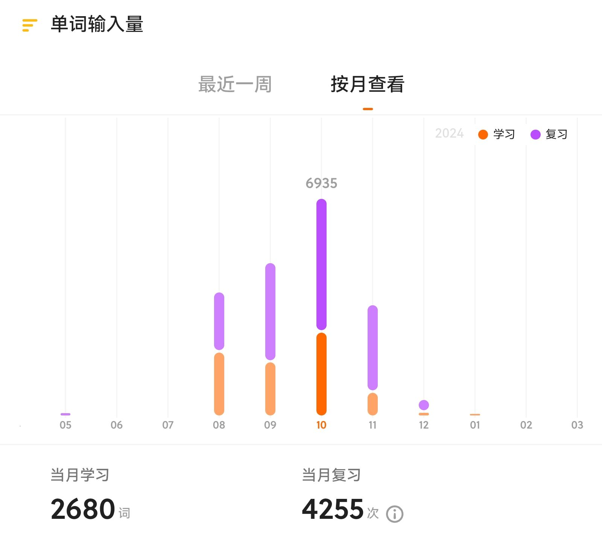

> 记录一下上岸前的所有准备工作

**2024/3/27** 收到了初步录取的电话通知 

**2024/4/3** 系统更新了初步录取结果

* 本文不侧重相关的复习经验，只做一个和经验分享格式类似的总结，可能更适合一些临时准备的同学作为参考。

## Intro

本科末9电信专业，本科期间数理基础尚可，综测88+，高数线代概率论90+，信号85，电磁场微波90+，简历有电子设计类国奖，四级擦边六级没过。择校规划：由于家在广东，想选一个离家近一点的深圳985，寒假最初定为哈工深，开学后改变主意定为清深。七月开始全心复习，整个流程基本没有大块的休息时间。初始分数不高，政治英语京区70+，入围复试排名在录取边缘，复试表现尚可，顺利上岸。

七月之前在忙一些竞赛，抽空完成了数学0轮(只看了高数和线代)，但没有什么用，一轮的时候发现忘光了…英语没背单词，专业课一眼没看。最初考虑夏令营走保研，但保外选择面较窄且不想保内，遂放弃，六月考试结束后休息到月末，7.1开始复习。

考研期间的大概作息是：暑假期间早八晚10，然后看1.5h政治；开学后前期早7.5晚11.5，冲刺阶段早7晚1.5，实际有效学习时间大概只有八到九成。因为对自己的复习水平极不自信，加之备考压力挺大的，初试准备期间各种疾病缠身，最后考试期间也没有很好的状态，得不偿失，还是建议以身体为重。

对于**时间安排**：可以通过例如总结的方式进行学习内容记录，前期可以每日一记，养成规律作息后可以定一周或一个月的阶段性目标；也可以挂个倒计时，总之最好要有比较明确的阶段性目标。

---

为保证以下内容真实性，附公共课小分如下

## 政治

初试73，客观题47。从七月开始复习，但其实太早没什么用，暑假每天晚上听徐涛强化，到暑假结束正好听完，期间用徐涛的黄皮书和肖的全书勾画，做了一遍徐涛的习题册。开学后刷了两遍肖1000，用小程序选择模拟，辅以腿姐和肖的小册子背知识点，每天1.5h左右。模拟卷出后分别做了腿姐徐涛米鹏和肖八的客观题，之后肖八客观题二刷和马原客观题背诵，肖四出后全身心肖四，每天大概3.5h，背了全部大题标准答案和速记，前后做了两次全文抄写和默写。客观题的分数这么高是比较意外的，平时模拟大概只有35左右，考场上只觉得题目好简单，大题也都基本是肖四，一直写到打铃，手都要写断了…建议就是时间允许可以暑假就开始，但没必要太早，有很多大佬都是九月才开始，本人自认为很笨，对文科东西相当不敏感，本着“笨鸟先飞”的原则就尽早开始了，最后结果还算可以接受。

肖四还是很重要的，24年运气很好肖老压中了很多，每年的大纲也基本大差不差，时间和精力允许的情况下建议把答案完整背诵并最好默写一遍。网上有很多助记，前提是你已经对肖四的内容熟悉80%以上，这些助记可以帮助你更好缕清脉络，单纯只靠助记，在京区的大题分数可能不是很乐观…

## 英语

初试73，客观题49.5，小作文6大作文9.5。英语基础并不好，大二下裸四级500+，六级考了两次至今未过…七月份开始准备复习，系统准备实际上是八月才开始。最开始做了一些黄皮书的模拟题，错的很惨，20个题只能对一两个…后来听了一些阅读技巧课，开始大量背单词，题目只系统做了真题，每天保持一定的量。作文是十一月才开始，没什么好的方法，背了几本书大概15篇范文，没有专门练字。英语分数不算高，给不了什么实质性建议，最主要的还是词汇量，语法因人而异吧，我复习的时候也看过一些语法课，但做了一些题之后感觉并没有太多作用，做阅读的时候还是侧重于对文章能否看懂、有无技巧套路可循。这里推荐一下唐迟的阅读课，我当时听的是18版的，新旧基本没区别，资源也有很多，对于应试而言还是有用的，或者看他那本《阅读的逻辑》，和课程内容一致的。

附八月开始用不背单词APP的记录，每天大概用了1h左右。建议是：切忌主观臆断和过度自信(当然基础好的当我没说)，做了一些真题尤其是二刷的时候准确率很高而自满，复习尤其是打基础阶段还是一步一个脚印比较好…

## 数学

初试97，数学考的很烂，实在没什么可分享的，出来对答案错了7个选填像做梦一样，也差点就二战了…复习也按照主流的顺序进行一轮二轮等，十月初开始模拟卷，市面上基本的模拟卷也做得差不多，模拟时大概保持在130左右。0轮过了一遍书，做了一半的660；一轮高数用的武忠祥、线代李永乐、概率论余炳森，习题选的李林880；二轮选的张宇和李正元的全书，习题用的张宇1k，李正元的全书我感觉还是不错的，个人一直对我的线代水平很不自信，现在看来还是基础不扎实，李书中有一些推导和题目复习的时候给了我不少启发，但他的模拟卷就不要做了，没营养且浪费时间…真题也挺重要的，需要吃透，但没有必要二刷；模拟卷推荐合工大超越和李艳芳吧，当时做觉得难度挺大，考完觉得和今年真题难度和计算量还是挺贴近的。

给一些教训就是注重基础和心态吧，有些复习其实点到为止就可以了，反复的去看一些类似于错题整理、偏难怪题目不会对你的临场发挥有任何实质性帮助。还记得临考那天早上早起看了3h的错题，越看越发现不会，加上身体状态差，考前心态就已经崩了，没上战场就已经认输，怎么会分数高…

## 专业课

深圳今年第一年考957，即信号和电磁场，如果决心考957，报个**芝麻研途**无脑跟就行了，可以替你解决90%准备材料和不懂的问题，资料也很全面，即使是免费的也足够你上岸用了。信号今年开始包含了DFT的东西，虽然没写考但还是考了，一个字不会写…参考书信号郑君里、电磁场郭硕鸿的电动力学、王蔷和罗春荣也最好看一看，其次就是清华本科的课件。信号的难度也有所增加，注意知识点的覆盖要尽可能全面，特别是在加完DFT之后，注重这门课整体体系的理解；电动力学郭书的课后题很重要，历年的真题也很重要，这些都是必须100%吃透的，今年运气好比较简单，电磁辐射没有考察，那个也是很容易考的。信号比较侧重全面和计算能力，而电磁场更多是背诵了，不要钻牛角尖，过来的经验就是：钻了对你提分一点用没有，老师100%不会那么想那么考，无止境的往深水区游最后只会淹死你自己…

## 复试

因为初试分数并不高，运气比较好进了复试，名次比较靠后，复试准备的还算比较充分。大致内容就是英语+全部的主修课程+简历项目细节，也感谢芝麻的学长准备的复试资料和模拟面试。深圳今年对英语的考察，我抽的那道题感觉是文献过于简单了，老师临场又问了两个我两个个人相关的问题，我之前并没有准备，现场乱说一通，当时心凉半截…建议之后准备的时候都准备一些。至于专业课和简历因人而异吧，当时准备了很多，但最后提问的方向和准备的还有挺大差距。

今年给我的感觉是：老师挺看重本科的成绩和简历，老实来说复试我表现得并不好，本科一堆硬件经历但写了通信的研究规划，加上一个FPGA的毕设，被老师全程拷打通信相关，虽然基本都接住了，但 整场下来体验感极差，刚出来以为寄定了…如果你的出身不是很高(比如一些末9中下2)，那本科成绩不要太差，最好不怎么挂科，综测不下80更好(当然如果有其他亮点可以给你拉上来)，尤其是在今年这种初试成绩拉不太开，后面十分左右差十多名这种情况，更多看你的前三年学习能力，也就是成绩和项目来体现。就像23年刷跨考一样，今年也不乏一些初试排名20多、历年都处在很稳的位置的同学被刷，深圳老师真挺魔幻的，仔细想想当时问我的一些抽象问题，心有余悸…

复习方法的话，每个人有自己最好的复习记忆方式，准备时很难做到面面俱到，现场更多是要表现得比较自信。深圳感觉越来越有可以翻盘的可能，平日的积累和临场的表现都挺重要的…

## 写在最后

突然想起过去大半年备考的辛酸…本人本科并没有多么出色，算是平平无奇过去的，大二开始才有努力学习，三年来至少没有放弃过自己，才有今日。考研真的是挺辛苦的，作为一个普通人有幸上岸，运气好之外，踏踏实实的努力也是必不可少的。建议每一个想考研的同学自己想一下：为什么要读研、想从事的方向、上岸之后的规划、自己是否需要这样一份学历等问题。总有一个你需要看清的时刻，最好是三年前，其次是现在，当然一年以后上岸了再想也不算晚。其次就是由问题引出的报考方向确定，建议不要以抄底为目标，否则你的目光会更倾向于报录比、有无抄底可能等方面，合适的关注有助于做出正确的决定，但以抄底为目的的考研注定是会失败的，切记。

感谢芝麻对初复试全程的帮助，感谢JLU的出身能让我看得更远，感谢和我一起备考的各位研友，也感谢自己始终没有放弃，更感谢我的家人，在每一个重大决策时尊重我的意见并始终支持我走到今天。就如考生自述我所写的那样：

> 四年时光匆匆，一路上结识的良师益友，都促使着我成为更好的自己。

---

另外，个人整理了一份自用的全流程资料 托管在Google云盘下 有需要可以自取

链接：[考研资料整理](https://drive.google.com/drive/u/0/folders/1Nwt3KA6iYzm797GPaxY_AtbfqmjvIein) 
