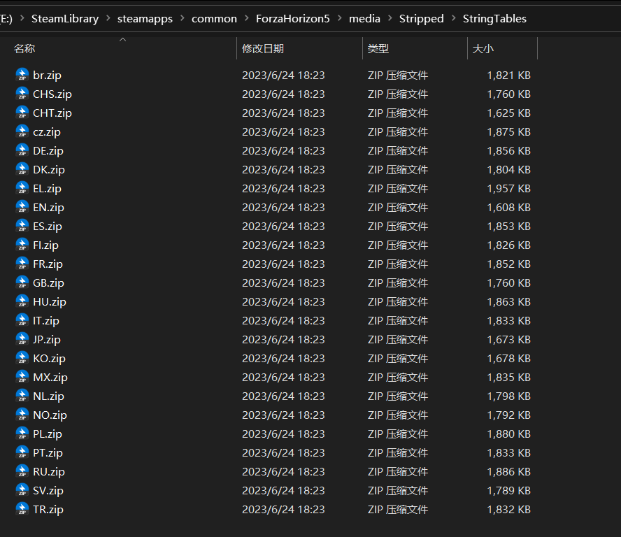

# Forza Horizon 5 CHS to EN

作为一个从地平线4转到5的半个老玩家(指游戏时长400h) 最近5的五折没忍住剁了手 兴致勃勃地下好后开玩 然后就发现这个不是很适应的中文配音 总感觉少了一些味道 和4的配音相比让我不太适应 于是找了一些教程 一通改之后效果甚微 而后还是找到了一个可以完美解决的方案

首先先查看自己的PC用户名是否带中文 如果带中文 要先修改为全英的 网上的一些教程效果一般 排雷不方便 这里推荐去tb搜 用户名修改英文 花10rmb以内 大概10min改完 **这步比较重要**

然后就是网上的通常教程(网页来源哔哩哔哩)：[地平线5 英文配音中文界面修改教程](https://www.bilibili.com/video/BV1jS4y157E5/) 

主要就是找到你的工程下的这个文件夹下 将`CHS`与`EN`的压缩包内容互换 就是修改名称 记得做好备份

注意：繁中的由于版本更新 目前也是带有tw腔的中文 而不再是英文 还是需要直接修改音频控制文件

然后在游戏加载页面 选择系统语言的时候 如果你的默认是英文名称 第一次system language就默认是英文 这个时候你需要勾选语言为 US的选项(具体的忘记了 但不是简体中文 因为你们已经换过来了 也就是简中对应的是英文字幕和中文配音) 然后重启 

再进入游戏 就可以看到简中字幕和英文配音(听到) 

如果第一步你没有操作 中文名进入的话 你会发现你无法修改默认语言 他永远是锁定了默认 即使你换成英语 你下次再点开还是系统默认的选项(别问我是怎么知道的 嘤嘤嘤)

之后就可以享受你的墨西哥之旅了!~

(不过最近没时间了 有学上之后我会好好享受的 呜呜呜)

---

