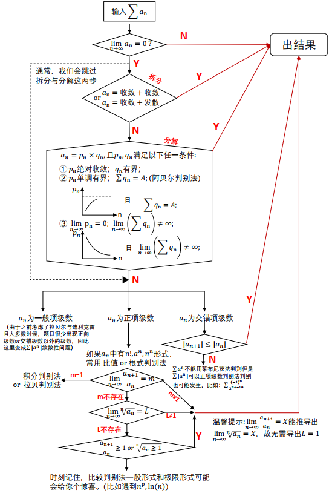
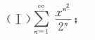
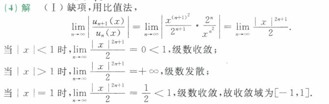
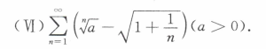
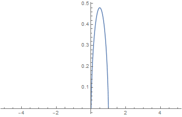

# 级数の判别

看到级数 高数一轮要看完了(

本科这里学的不好 找到了本科学习期间老师扩展的一些笔记 做一个整理和备份 再加一些典型例题

* 书上和各种资料上都有的不写了

## 数项级数判别法

如果级数**收敛** 则**添加括号**后也收敛 **逆否命题也成立**：添加括号后级数发散 则原级数**发散**

**级数收敛的必要条件**：极限是0 **必要条件** 逆否成立 即
$$
\lim_{x\to\infty}\ne0\Rightarrow\sum_{n=1}^\infty u_n发散
$$
比如一道题：(强调其对于$\ln x$到$\sqrt x$的构建) : 

**判断敛散性**：$\sum_{n=1}^\infty (n^{\frac1{n^2+1}}-1)$ （**收敛**）
$$
n^{\frac1{n^2+1}}-1=\exp(\frac{\ln n}{n^2+1})-1\sim\frac{\ln n}{n^2+1}<\frac{\ln n}{n^2+1}<\frac{\sqrt n}{n^2}=\frac1{n^{\frac32}}\bigg|_{n\to\infty}
$$

### 比值判别法

也就是达朗贝尔判别法

### 根值判别法

也就是柯西判别法  标尺函数：**几何级数**

(**比值能做的 根值都能做** 一般带有$n$次的用根值判别) 

### 极限审敛法

设 $\sum_{n=1}^{\infty} u_n$ 为**正项级数**

1. 如果 $\lim _{n \rightarrow \infty} n u_n=l>0\left(\right.$ 或 $\left.\lim _{n \rightarrow \infty} n u_n=+\infty\right)$, 那么级数 $\sum_{n=1}^{\infty} u_n$ 发散;
2.  如果 $p>1$, 而 $\lim _{n \rightarrow \infty} n^p u_n=l(0 \leqslant l<+\infty)$, 那么级数 $\sum_{n=1}^{\infty} u_n$ 收敛.

极限法的作用域比比值判别法的小 比值判别法没有域的缺失 主要注意**失效条件**下的收敛和发散

### 拉贝判别法

(标尺函数：**p级数**)  

设 $\sum_{n=1}^{\infty} u_n$ 为**正项级数** $\exists N,\forall n > N$

1. $\frac{a_{n+1}}{a_n}\le1-\frac pn(p>1)$ 则$\sum a_n$收敛
2. $\frac{a_{n+1}}{a_n}\ge1-\frac pn(p\le1)$ 则$\sum a_n$发散

极限形式：
$$
\lim_{n\to\infty}n(1-\frac{a_{n+1}}{a_n})=r
$$
则$r>1$收敛，$r<1$发散,$r=1$敛散不定

### 高斯判别法

(标尺函数：$\frac1{n\ln^pn}$)

设 $\sum_{n=1}^{\infty} u_n$ 为**正项级数** $\exists N,\forall n > N$
$$
\frac{a_{n+1}}{a_n}=\lambda+\frac\mu n+\frac v{n\ln n}+o(\frac 1{n\ln n})
$$

1. $\lambda>1$收敛，$\lambda<1$发散
2. $\lambda=1$下，$\mu>1$收敛，$\mu<1$发散
3. $\lambda=1,\mu=1$下，$v>1$收敛，$v<1$发散
4. 对于$\lambda=\mu=v=1$则失效

可以看到拉贝判别法本质就是低阶的高斯判别法

**一个例题：**$\sum_{n=1}^\infty \frac{(2n)!!}{(2n-1)!!}$敛散性 **(发散)**

用比值判别法的话会得到1 然后缩不动

采用拉贝判别法(低阶高斯判别法)
$$
\frac{a_{n+1}}{a_n}=\frac{2n+1}{2n+2}=1-\frac1{2n+2}=1+\frac1{n}(-\frac n{2n+2})
$$
后项系数为$-\frac n{2n+2}<1$所以发散

实际上 可以得到这个$a_n$的通式的范围是$[\frac1{\sqrt{4n}},\sqrt{2n-1}]$也可以证明是发散的

### 积分判别法

要求$f(x)$在$[1,+\infty)$非负且单调递减 并有$f(n)=a_n$ 则有下敛散性相同
$$
\sum_{n=1}^\infty a_n\sim\int_1^{+\infty}f(x)dx
$$
其本质是 **矩形条的面积**与**曲线所围成的曲边梯形面积** 在$n\to\infty$的情况下一致

### Leibniz判别法

针对于交错级数 由此引出很多的“不定”(见张宇总结)

不要和极限存在搞混了：是单减且**极限为0** 不是单减有下界

### Cauchy收敛准则

级数 $\sum_{n=1}^{\infty} a_n$ 收敛的**充要条件**

 对于任意 $\varepsilon>0$ 存在正整数 $N$, 使得对任意 $m>N$ 和正整数 $p$
$$
\mid a_{m+1}+a_{m+2}+\cdots+a_{m+p}\mid<\varepsilon
$$

---

> 一个常用的不等式：$2^n>n^p>\ln n$ 在 **n充分大**总成立

条件级数的所有正项/负项构成的级数一定发散

单独记一下比较特殊的一个:$\sum_{n=2}^\infty \frac1{n\ln n}$发散(用上面那个常用不等式可以理解)

**注意：以上的各种判别法 都是收敛的充分条件 也就是成立则收敛 充要条件见Cauchy收敛准则**

* 记一个肯定看过但忘了在哪了的结论：

  若$\lim_{n\to0}b_n=0$，且$\sum_{n=1}^\infty|a_n|$收敛 则有：$\sum_{n=1}^\infty a_nb_n$收敛

---

## 绝对收敛

级数的几种状态：绝对收敛、条件收敛、发散

绝对收敛级数有 **可交换性**

**级数黎曼定理**：若$\sum a_n$**条件收敛** 则$\forall\varepsilon\in R$
$$
\displaylines{\sum a_n’=\xi&(-\infty<\xi<\infty)\\}
$$
 $\sum a_n’$为$\sum a_n$的重排

**Cauchy乘积**：
$$
\begin{array}{l}\left(\sum_{n=0}^{\infty} a_n\right) \cdot\left(\sum_{n=0}^{\infty} b_n\right)=\sum_{n=0}^{\infty} c_n
\end{array}
$$
 其中 $c_n=\sum_{k=0}^n a_k b_{n-k}, n=0,1,2,\ldots$

### Cauchy定理

若$\sum a_n$和$\sum b_n$分别 **绝对收敛**于$A$和$B$ 则 $\sum c_n$可以按 **任意方式**排列 且都**收敛于$AB$**

### Mertens定理

若$\sum a_n$**绝对收敛**于$A$ $\sum b_n$ **普通收敛**于$B$ 则$\sum c_n$以下方式排列 可以收敛于$AB$
$$
c_n=\sum_{i=1}^naib_{n-i}=a_1b_n+a_2b_{n-1}+\ldots
$$

### Abel定理

若$\sum a_n$和$\sum b_n$分别 **普通收敛**于$A$和$B$ 若$\sum c_n$收敛 则必有$\sum_{n=1}^\infty c_n$收敛于$AB$ $c_n$如下排列
$$
c_n=\sum_{i=1}^naib_{n-i}=a_1b_n+a_2b_{n-1}+\ldots
$$

> 以上三个定理的程度是递减的

### Dirichlet判别法

对于$\sum a_n$ 若$a_n$单调 且$\lim_{n\to\infty}a_n=0$ 且$\sum b_n$ **部分和序列**($S_n$)有界 则有 $\sum_{n=1}^\infty a_nb_n$收敛

可以看出 交错级数的Leibniz判别法是$b_n=(-1)^{n+1}$时的特例

### Abel判别法

对于$\sum a_n$ 若$a_n$单调 且$\sum b_n$收敛 则 $\sum_{n=1}^\infty a_nb_n$收敛

常用于构造奇偶序列

## 函数项级数

$\sum_{n=0}^\infty u_n(x) \  x\in I$,$S_n(x)=\sum_{k=0}^n u_k(x)$ 表示其有限项和 $R_n(x)=S(x)-S_n(x)$ 若有
$$
\displaylines{
\lim_{n\to\infty}S_n(x)=S(x)\Leftrightarrow \lim_{n\to\infty}R_n(x)=0
}
$$
称为函数项级数**收敛**

**函数项收敛&发散无法传递到和函数**

### 逐点收敛&一致收敛

$\forall \varepsilon>0,\forall x\in I,\exists N>0,|S_n(x)-S(x)|<\varepsilon$ 则称为 **逐点收敛**

$\forall \varepsilon>0,\exists N>0,\forall x\in I,|S_n(x)-S(x)|<\varepsilon$  则成为 **一致收敛**

二者的区别在于$\forall-\exists$位置的不同 也就是**逐点收敛**的$\exists N$取值与$x$和$\varepsilon$都有关 具有**局部性**；**一致收敛**的$\exists N$取值只与$\varepsilon$有关 对于整段的$x\in I$都成立 表示整体的$N$，通用的$N$

**一道例题**

证明：$\sum_{n=0}^\infty x^n$在$|x|<1$驻点收敛，在$|x|\le r<1$下一致收敛

**证明：**
$$
\displaylines{
S_n(x)=\frac{1-x^n}{1-x}=\frac1{1-x}-\frac1{1-x}x^n\\
|x|\le r <1\Rightarrow |x^n|\le |r^n| <\varepsilon,n\ln |r|\le\ln\epsilon,n>\left[\frac{\ln \varepsilon}{\ln|r|} \right]=N\\
|x|<1\Rightarrow|x^n|<\varepsilon,n>\left[\frac{\ln \varepsilon}{\ln|x|} \right]=N
}
$$
前者的$N$为定值 而后者不是定制 不可能一致收敛

### 一致收敛判别法

#### Cauchy判别准则

$$
\forall \epsilon>0,\exists N,\forall m,n>0,\forall x\in I\Rightarrow|S_n(x)-S_m(x)|<\epsilon
$$

#### M判别法(Weierstrass)

若$\sum_{n=0}^\infty M_n \ (M_n\ge0)$ 收敛 且$\exists N,\forall n>N,\forall x\in I$ 有$|u_n(x)|\le M_n$ 则$\sum_{n=0}^\infty u_n(x)$在$x\in I$上一致收敛 $M_n$的上界即为$u_n(x)$的上界

**例题**：$\sum_{n=0}^\infty \frac{\sin x}{n^2}$

由M判别法
$$
|\frac{\sin x}{n^2}|\le\frac1{n^2}
$$
且右侧收敛 则原级数**一致收敛**

### 一致收敛函数项级数的和函数的分析性质

包括 **连续、可微、可积**

#### 连续

若函数项级数$ \sum u_n(x)$ 在区间 $[a,b]$ 上**一致收敛**，且每一项都连续，则其和函数在 $[a,b]$ 上也连续。
$$
\lim_{x\to x_0}S(x)=\lim_{x\to x_0}\sum_{n=1}^\infty u_n(x)=\sum_{n=1}^\infty\lim_{x\to x_0}\overline u_n(x)=\sum_{n=1}^\infty u_n(x_0)=S(x_0)
$$
这个定理保证了，在一致收敛的前提下，求和运算和求极限运算可以交换顺序。

**证明**：(考完研一定敲出来)

#### 可微

若函数项级数 $\sum u_n(x)$ 在区间 $[a,b]$ 上每一项都有连续的导函数， $x_0 \in [a,b]$ 是它的收敛点，且 $\sum u_n'(x) $在 $[a,b]$ 上一致收敛，则
$$
\sum_{n=1}^\infty \left( \frac{\mathrm d}{\mathrm dx}u_n(x) \right)=\frac{\mathrm d}{\mathrm dx}(\sum_{n=1}^\infty u_n(x)).
$$
**证明**：

#### 可积

若函数项级数 $\sum u_n(x)$ 在区间 $[a,b]$ 上一致收敛，且每一项都连续，则 
$$
\sum_{n=1}^\infty \int_a^b u_n(x) \mathrm dx = \int_a^b \sum_{n=1}^\infty u_n(x)\mathrm dx.
$$
**证明**：

## 幂级数

注意一个只含奇次或偶次的ROC
$$
\displaylines{
\lim_{n\to\infty}\bigg|\frac{a_{n+1}}{a_n}\bigg|=\rho\Rightarrow R=\sqrt{\frac1\rho}\\
\lim_{n\to\infty}\sqrt[n]{a_n}=\rho\Rightarrow R=\sqrt{\frac1\rho}\\
}
$$
这里补充一个**Abel第一收敛定理**的推论：

$\sum_{n=0}^\infty a_nx^{mn+p} \ (m,n,p\in R)$ 则以下成立
$$
\displaylines{
\lim_{n\to\infty}\bigg|\frac{A_{n+1}(x)}{A_n(x)}\bigg|=\lim_{n\to\infty}\bigg|\frac{a_{n+1}x^{m(n+1)+p}}{a_nx^{mn+p}}\bigg|<1 \\
\lim_{n\to\infty}\sqrt[n]{|{a_nx^{mn+p}}|}<1
}
$$
 用于求解$|x|<R$ 本质是一致的

设级数 $\sum_{n=0}^{\infty} a_n x^n$ 与 $\sum_{n=0}^{\infty} b_n x^n$ 的收敛半径分别为 $R_1$ 和 $R_2$, 则当 $R_1 \neq R_2$ 时, $\sum_{n=0}^{\infty}\left(a_n+b_n\right) x^n$ 的收敛半径 $R=\min \left\{R_1, R_2\right\}$.

这里记一道题 当$x$的幂带有$n$ 无法直接求解出闭式解 通过讨论$x$的范围即可

**关于增速的比较**

> 以下内容来源ChatGPT

对于正数x，初等函数的增长速度一般可以从慢到快排列如下：

1. 常数函数，如$y = c$，其中$c$是常数，函数的增长速度为0。
2. 对数函数，如$y = \log(x)$，对于大于1的$x$，函数增长缓慢。
3. 幂函数，如$y = x^n$，其中$n$为正数。随着$n$的增大，函数的增长速度也会加快。
4. 指数函数，如$y = a^x
   $，其中$a>1$。随着$a$的增大，函数的增长速度也会加快
5. 阶乘函数，如$y = x!$，该函数的增长速度非常快。

$$
\lim_{x \rightarrow +∞}{\frac{x^\alpha}{c^x}}=0
$$

### 一些常用的幂级数

$$
\displaylines{
\left\{
\begin{array}{l}
\tan x=\sum_{n=1}^{\infty}{\frac{\left( 2^{2n}-1 \right)2^{2n}B_{n}}{\left( 2n\right)!}}x^{2n-1}
=x+\frac{1}{3}x^{3}+\frac{2}{15}x^{5}+\frac{17}{315}x^{7}+\cdots\\
\arctan x=\sum_{n=1}^{\infty}\frac{(-1)^nx^{2n+1}}{2n+1}\\
-\ln(1-x)=\sum_{n=1}^\infty\frac{x^{n}}{n}\Rightarrow
-\ln (1-x)-x = \sum_{n=1}^\infty\frac{x^{n+1}}{n+1}\\
\ln \sqrt{1+x^2}=\frac{1}{2} \ln \left(1+x^2\right)=\frac{1}{2} \sum_{n=0}^{\infty}(-1)^n \frac{x^{2 n+2}}{n+1}=\sum_{n=0}^{\infty}(-1)^n \frac{x^{2 n+2}}{2 n+2},|x| \leqslant 1\\
\frac1{x^2+1}=1+\sum_{n=1}^\infty(-1)^n \frac{(2n-1)!!}{n!2^n}x^{2n},|x|\leqslant 1\\
\ln (x+\sqrt{1+x^2})=x+\sum_{n=1}^\infty(-1)^n \frac{(2n-1)!!}{n!2^n(2n+1)}x^{2n+1},|x|\leqslant 1\\
\end{array}
\right.
}
$$

补充个特殊的展开
$$
\lim_{x\to\infty}(1+x)^{\frac1x}=e-\frac e2x+\frac{11}{24}ex^2-\frac7{16}ex^3+o(x^3)
$$

---

## 例题

> 记一些方法比较好 一般不敢或不会想的法子

**Answer**：由泰勒公式, 得
$$
\begin{aligned}
& \sqrt[n]{a}-\sqrt{1+\frac{1}{n}}=\mathrm{e}^{\frac{\ln a}{n}}-\left(1+\frac{1}{n}\right)^{\frac{1}{2}} \\
= & 1+\frac{1}{n} \ln a+\frac{1}{2} \cdot \frac{1}{n^2} \ln ^2 a+o\left(\frac{1}{n^2}\right)-\left[1+\frac{1}{2} \cdot \frac{1}{n}+\frac{1}{2} \cdot \frac{1}{2} \cdot\left(-\frac{1}{2}\right) \cdot \frac{1}{n^2}+o\left(\frac{1}{n^2}\right)\right] \\
= & \left(\ln a-\frac{1}{2}\right) \cdot \frac{1}{n}+\frac{1}{n^2}\left(\frac{1}{2} \ln ^2 a+\frac{1}{8}\right)+o\left(\frac{1}{n^2}\right) .
\end{aligned}
$$
当 $\ln a-\frac{1}{2}=0$, 即 $a=\sqrt{\mathrm{e}}$ 时, 级数收敛;
当 $\ln a-\frac{1}{2} \neq 0$, 即 $a \neq \sqrt{\mathrm{e}}$ 时, 级数发散.

* $n$的下标 要始终保证至少是0 对于大于0的要保留 但小于0的不能取 要变到0

---

一个常用的结论：$\sum_{n=2}^\infty\frac1{n\ln^p n}$收敛的条件是$p>1$ 由此可以有$\sum_{n=2}^\infty\frac1{n\ln n}$是发散的 证明过程采用**积分判别法** 

一个常用级数和：
$$
\sum_{n=0}^\infty nx^n=\frac x{(1-x)^2}
$$

* 幂级数的展开 **一定要写到一起** 除非是系数不符合通式的情况 否则**都要写到$\sum$里面**

---

补一个函数的图形：$\ln x\ln(1-x)$ 

