# 空间解析几何

总结一些做题碰到的空间解析几何的解题方法 搭配一些习题

以下题目来源于 **李林880**

> 本人空间感很差 本科学的时候这块就是糊弄过去的 所以整理的可能过于基础甚至白痴 见笑

## 三向量共面

**混合积为0** 

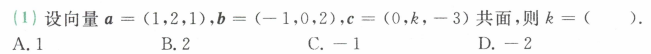

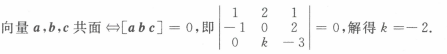

## 点到面距离

$$
d=\frac{|Ax_0+By_0+Cz_0+D|}{\sqrt{A^2+B^2+C^2}}
$$

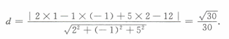

## 点到直线距离

$$
d=\frac{\sqrt{|(x_1-x_0,y_1-y_0,z_1-z_0)\times(l,m,n)|}}{l^2+m^2+n^2}
$$

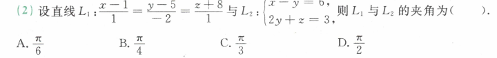

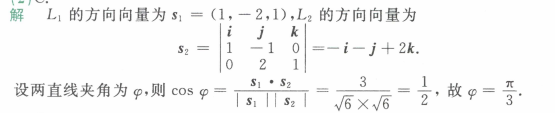

## 直线间距离

将其中一个直线(设为$L_1$)表示成平面束方程 求其与$L_2$平行的平面束的参数$\lambda$ 再取$L_1$上任意一点到平面的距离 即是两直线的距离

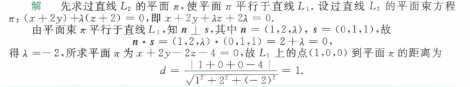

## 直线到平面的投影

已知直线方程(一般式或点向式)和平面形式(一般是点法式)

### 特殊情况：平面是坐标面

消掉坐标面的那个变量 得到$F(x,y)=0$平面方程 联立

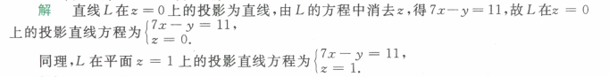

### 普通情况

求出直线的方向向量 与法向量做叉乘得到新的平面的法向量 并带入原直线上的一点 并与已知平面联立

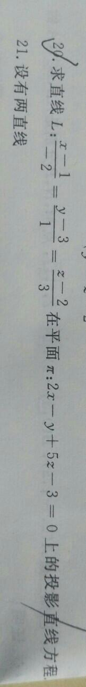

解法：$s_1=(-2,1,3),n=(2,-1,5)\Rightarrow\ k=s\times n=(1,2,0)$,取直线上的点$(1,3,2)$得到平面方程$(x-1)+2(y-3)+0(z-2)=0$,联立即可得到
$$
\displaylines{\left\{\begin{array}{l}
2x-y+5z-3=0\\
x+2y-7=0
\end{array}\right.}
$$

### 化成平面束的形式

将直线化成**一般式** 应用平面束 得到参数$\lambda$值 联立

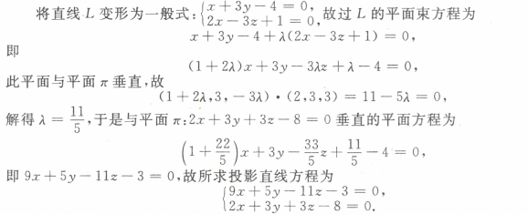

## 两平面夹角

两平面夹角**是指更小的∠** 故平面夹角和平面法向量夹角一样大 

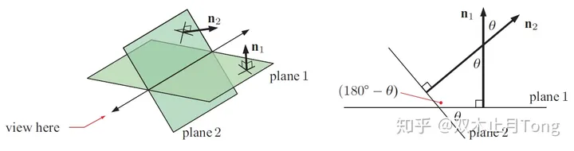

在这里可以认为 **二面角**和**平面夹角**是一个概念(来自维基百科) 

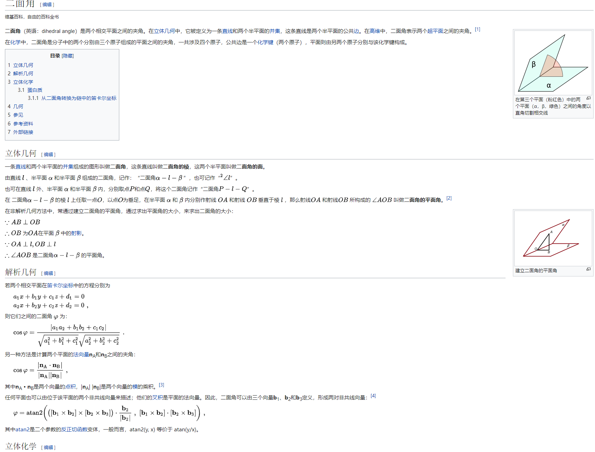

## 与两直线都垂直相交的直线

也叫 **直线的公垂线** 假设直线为$l_1$和$l_2$

做两条直线的方向向量叉乘得到新的直线方向向量；分别与两条已知直线的方向向量做叉乘 得到平面的法向向量；带入两条直线上的点 得到两个平面方程 联立

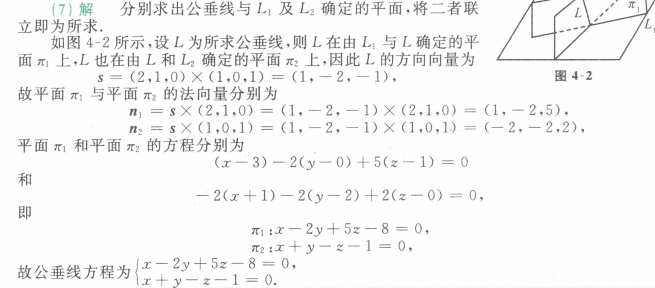

## 平面束方程

通常小题求解求快 一般情况下 只设一个参数 即
$$
\displaylines{\left\{\begin{array}{l}
A_1 x+B_1 y+C_1 z+D_1=0, \\
A_2 x+B_2 y+C_2 z+D_2=0
\end{array}\right.\\
A_1x+B_1y+C_1z+D_1+\lambda(A_2x+B_2y+C_2z+D_2)=0}
$$
这样会导致丢解 大题最好还是把参数设全 即
$$
\lambda\left(A_1 x+B_1 y+C_1 z+D_1\right)+\mu\left(A_2 x+B_2 y+C_2z +D_2\right)=0
$$
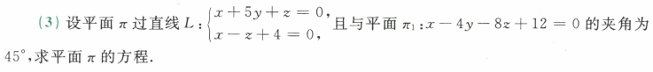

答案给出的方法是设另一个 从而得到0 但这种具有巧合性 所以全设可以得到一个为0一个是比例 进而不丢解

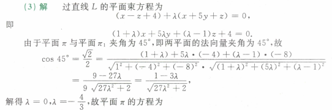

## 空间曲线绕固定直线旋转

题干一般为：**曲线方程 绕一个固定直线旋转**

### 通解

来自知乎上的一个解法 [空间曲线绕空间直线旋转生成的旋转曲面方程](https://zhuanlan.zhihu.com/p/61913816)

设空间曲线 $l_2$：
$$
\displaylines{\begin{equation} \left\{ \begin{aligned} & x=f(t)\\ & y=g(t)\\ & z=h(t)\\ \end{aligned} \right. \end{equation} }
$$
绕$l_1$ ： $\frac{x-x_0}{m}=\frac{y-y_0}{n}=\frac{z-z_0}{p}$ 旋转得到的曲面方程为 $\Gamma$ ，则 $\Gamma$的方程为：

$$
(x-x_0)^2+(y-y_0)^2+(z-z_0)^2=[f\big(F^{-1}(u)\big)-x_0]^2+[g\big(F^{-1}(u)\big)-y_0]^2+[h\big(F^{-1}(u)\big)-z_0]^2
$$
其中 $u=mx+ny+pz$ ， $F(t)=mf(t)+ng(t)+ph(t)$

* 上式验证成立

### 简单的定直线 

**例如平行于坐标轴**

写出直线参数方程表示$x=x(t),y=y(t),z=z(t)$

找到与哪个轴平行 这里以与$z$轴平行为例 
$$
\displaylines{d=\sqrt{(x-x_0)^2+(y-y_0)^2}\\
\left\{\begin{array}{l}
(x-x_0)^2+(y-y_0)^2=(x(t)-x_0)^2+(y(t)-y_0)^2, \\
z=z(t) .
\end{array}\right.}
$$
之后找到上下关系进行化简

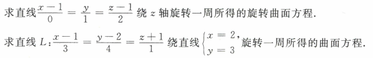

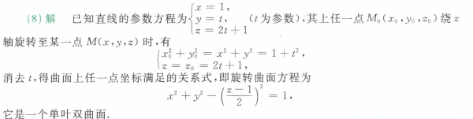

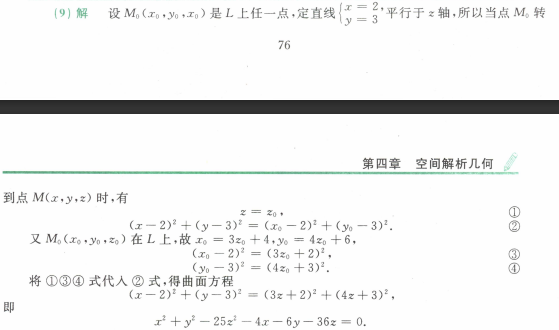
