# 二型积分

看到重积分和I型线面积分 大多数参考书给出了所谓的对称性 再看II型就基本没有写了(也可能我看的不够全) 然后就找到了这样一篇好文 总结的比较全面

[第二型曲线曲面积分的通用极简解法之一——对称性](https://zhuanlan.zhihu.com/p/572698663)

以下内容除个别字句之外完全相同 主要作用是个人方便 尊重原作

## 第二型平面曲线积分

1.**对称性解法如下（图中红色表示奇性，绿色表示偶性）：**

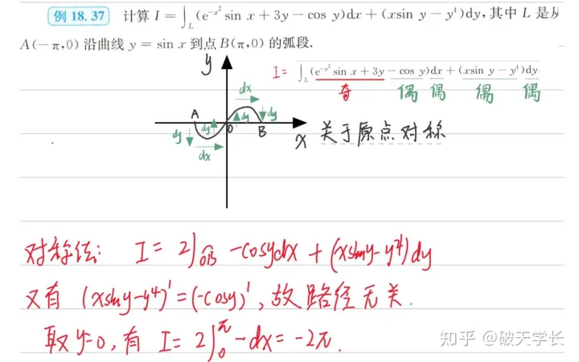

易知积分曲线关于原点对称，而被积函数与$dx$,$dy$分别具有奇偶性，根据奇×奇为偶，奇×偶为奇，偶×偶为偶的原理，可化简答案如图所示。

**辅导书的解析如下：**

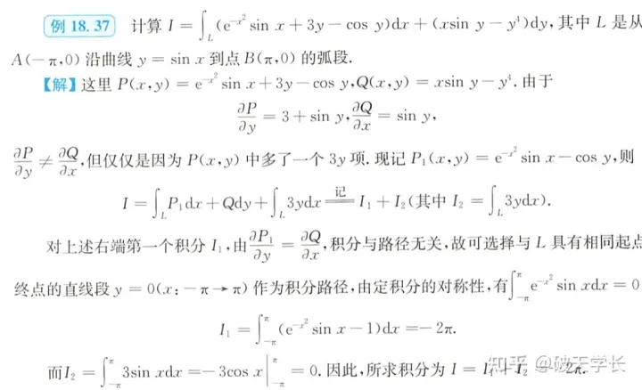

------

2.**对称性解法如下（图中红色表示奇性，绿色表示偶性）：**

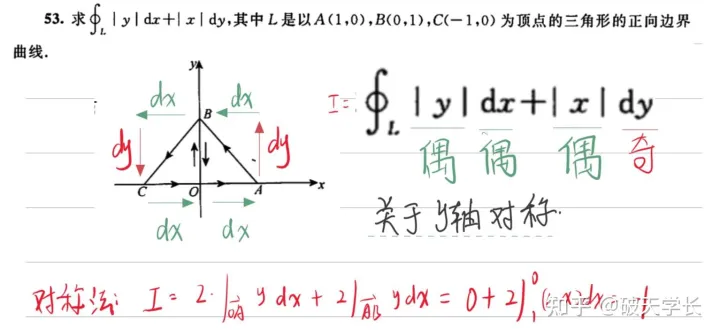

易知积分曲线关于y轴对称，而被积函数与dx.dy分别具有奇偶性，根据奇×奇为偶，奇×偶为奇，偶×偶为偶的原理，可化简答案如图所示。

**辅导书的解析如下：**

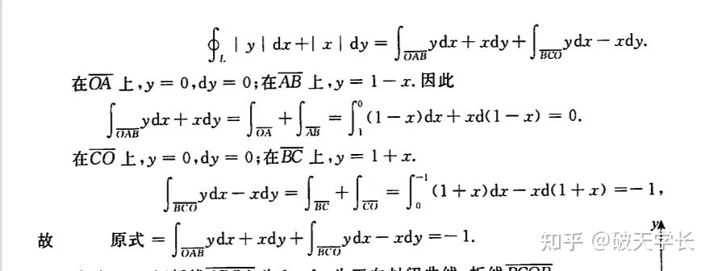

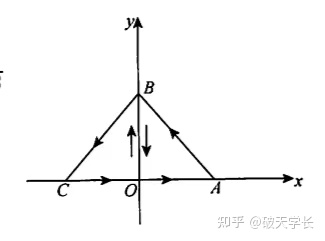

------

## 第二型空间曲线积分

**3.对称性解法如下（图中红色表示奇性，绿色表示偶性）：**

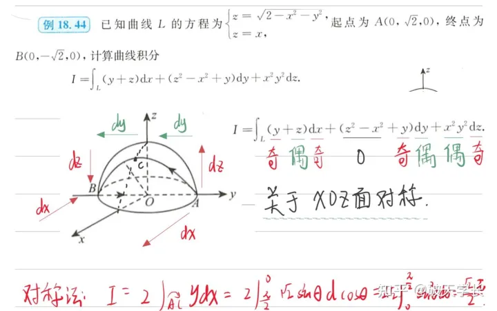

易知积分曲线关于$xoz$面对称，而被积函数与$dx.dy.dz$分别具有奇偶性，根据奇×奇为偶，奇×偶为奇，偶×偶为偶的原理，可化简答案如图所示。

**辅导书的解析如下：**

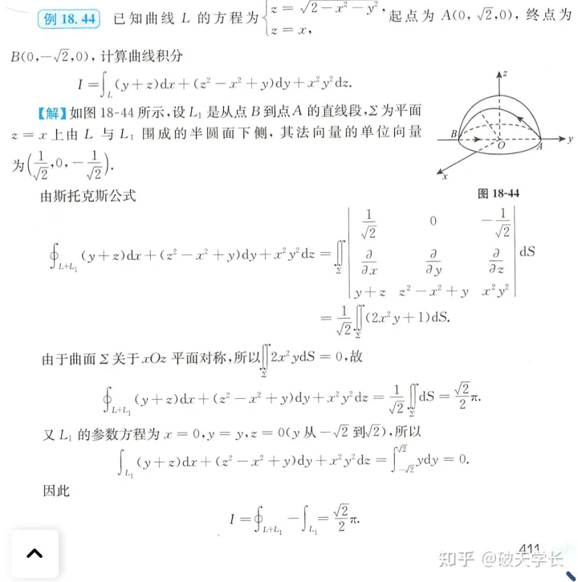

------

**4.对称性解法如下（图中红色表示奇性，绿色表示偶性）：**

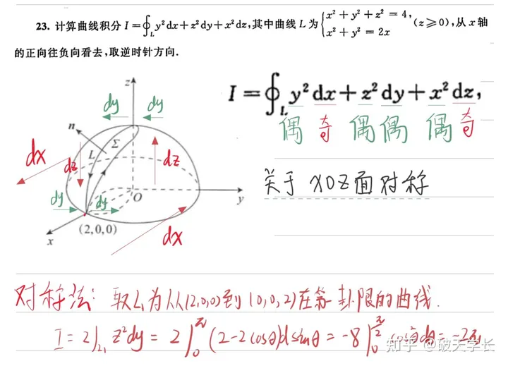

易知积分曲线关于$xoz$面对称，而被积函数与$dx.dy.dz$分别具有奇偶性，根据奇×奇为偶，奇×偶为奇，偶×偶为偶的原理，可化简答案如图所示。

**辅导书的解析如下：**

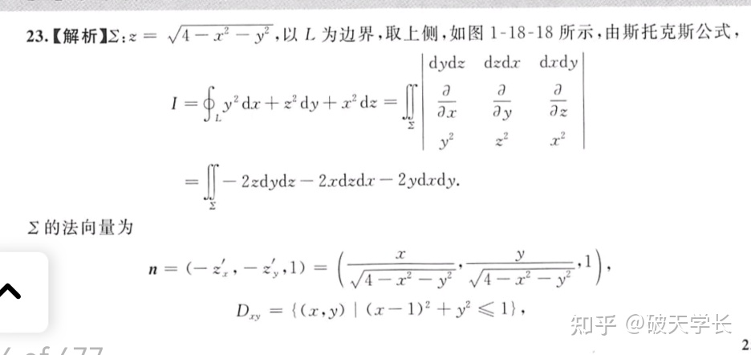

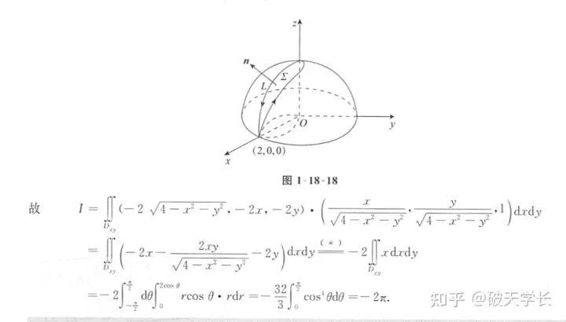

------

**5.对称性解法如下（图中红色表示奇性，绿色表示偶性）：**

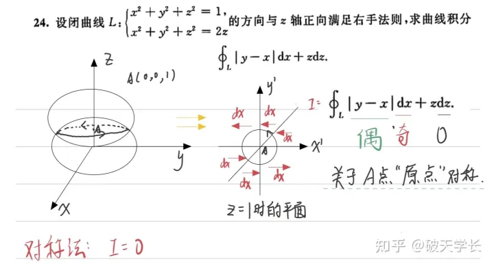

易知积分曲线关于$A(0.0.1)$原点对称，而被积函数与$dx.dz$分别具有奇偶性，根据奇×奇为偶，奇×偶为奇，偶×偶为偶的原理，可化简答案如图所示。

**辅导书的解析如下：**

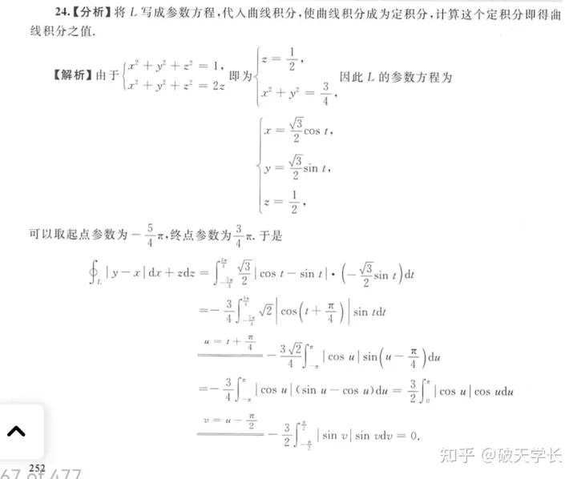

------

## 第二型空间曲面积分

**6.对称性解法如下（图中红色表示奇性，绿色表示偶性）：**

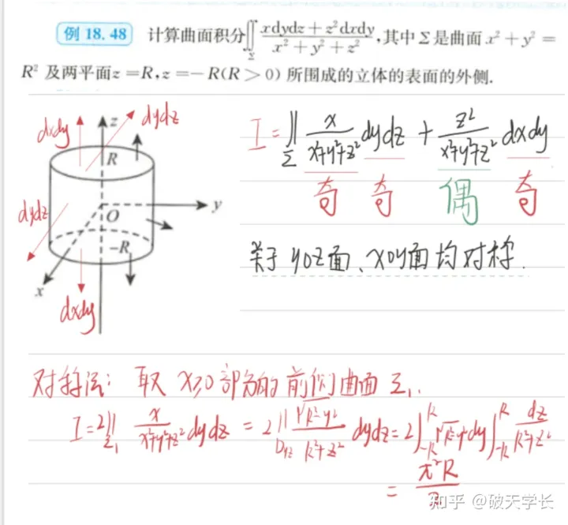

知积分曲面关于$xoy、yoz$面对称，而被积函数与$dydz.dxdy$分别具有奇偶性，根据奇×奇为偶，奇×偶为奇，偶×偶为偶的原理，可化简答案如图所示。

**辅导书的解析如下：**

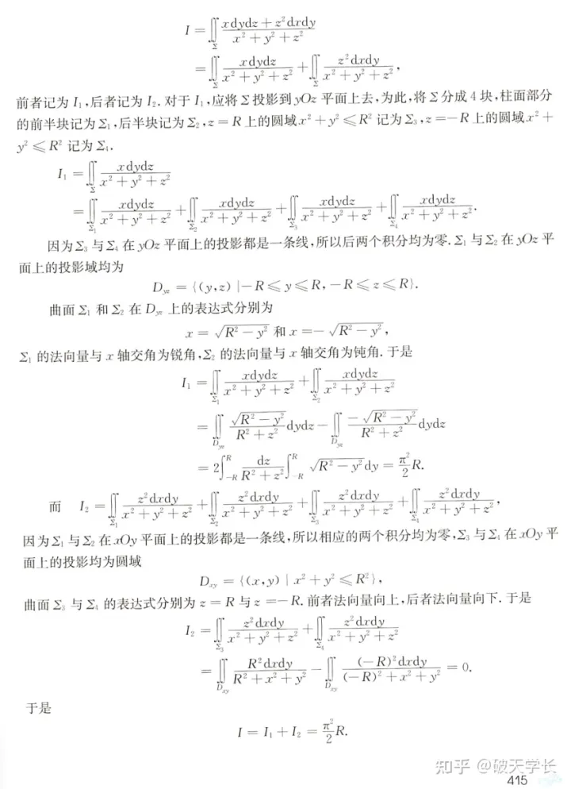

------

**7.对称性解法如下（图中红色表示奇性，绿色表示偶性）：**

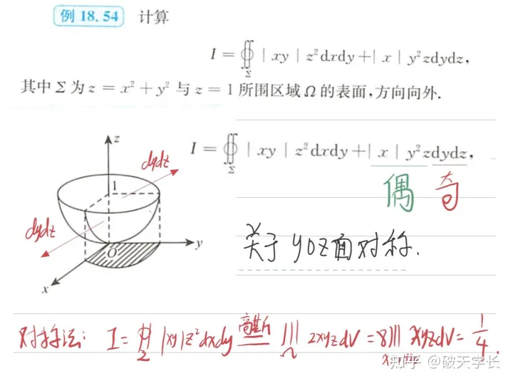

易知积分曲面关于yoz面对称，而被积函数与dxdy.dydz分别具有奇偶性，根据奇×奇为偶，奇×偶为奇，偶×偶为偶的原理，可化简答案如图所示。

**辅导书的解析如下：**

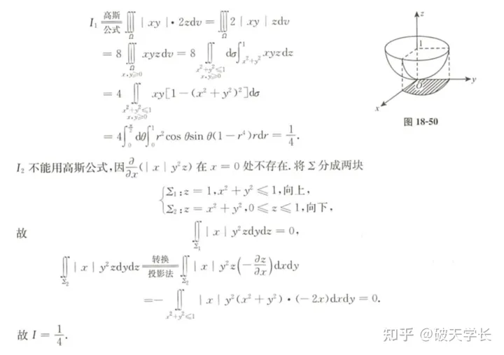

---

## 一点补充

> 自己做题遇到的一些需要注意的点

**1** I型曲面积分和II型的本质差别(指的是计算) 这个对称性 不要看反了 II型看的是$dxdy$等的方向变化 而I型看的是这个区间是否关于$xoy$面对称  比如上面的第六题 这个关于$yoz$对称 II型的$dydz$是奇的 而在I型这个$dS$就表示为偶的

还有就是 II型的一眼看出来的那种对称性 看的是除了这个面的两个分量以外的另一个分量是否有对称性

举一个例子

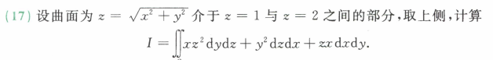

易得关于$zox,yoz$是对称的 那么第一项针对于$x$ 则$xz^2dydz$就是偶的；第二项$y^2$是偶的 那么$y^2dzdx$就是奇的

然后根据方向性来判断第三项：上侧 都是指向$z$正向的 也就是偶的 又有$z$是奇的 那么$zxdxdy$就是奇的

然后原式就可以化成一项 再用高斯公式就很简单了

或者直接无脑高斯公式 到$dV$里面判断 也可以

**答案如下**

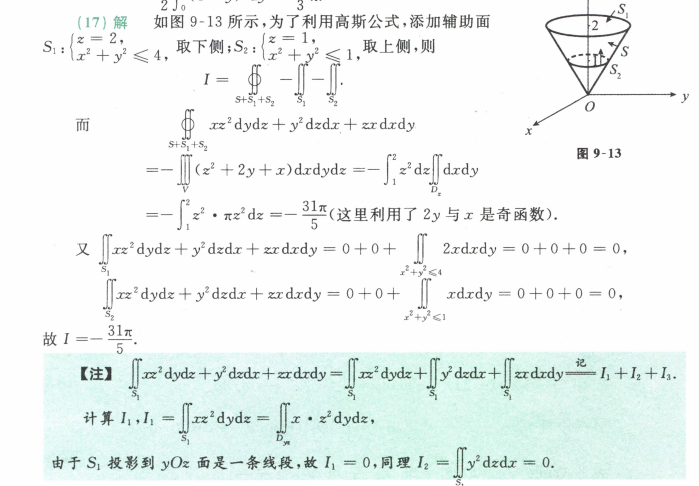

---

**2** 注意 用Green或Gauss公式补内部小$\epsilon$圆的时候 要以$\oint$分母项的形式为准 原本$S$的形状本质不重要 包含原点就行

### 空间曲线积分与路径无关的四等价条件

* 此部分来自本科教学的扩展

规定$\vec{A}(P,Q,R)\in C^{(1)}(\Omega)$ 则以下四条件等价

1. 沿$\Omega$闭合曲线 $\oint_LPdx+Qdy+Rdz=0$

2. $\Omega$中$\forall$两点之间积分值域路径无关

3. $\exists$势函数$u=u(x,y,z)$ 使得$du=Pdx+Qdy+Rdz$

4. $\forall M(x,y,z)\in\Omega$ 恒有 $\text{rot}(\vec{A}_u)=0$ 即
   $$
   \frac{\partial R}{\partial y}=\frac{\partial Q}{\partial z},\frac{\partial P}{\partial z}=\frac{\partial R}{\partial x},\frac{\partial Q}{\partial x}=\frac{\partial P}{\partial y}
   $$

此处不作证明 Stokes公式就是Green公式在三维平面的扩展 自然会有对应的与路径无关条件成立

---

### 一些特殊的积分计算

一个别人提到的：**罗巴切夫斯基**(**Lobachevsky**)积分公式

在$0\le x<+\infty$下，若$f(x\pm\pi)=f(x)$ ，则有
$$
\int_0^\infty f(x)\Big(\frac{\sin x}{x}\Big)dx=\int_0^\frac\pi2f(x)dx
$$
对于$f(x)=1$则等效为Dirichlet积分
$$
\int_0^{+\infty}\frac{\sin x}xdx=\frac\pi2
$$
同理可以得到
$$
\int_0^\infty f(x)\Big(\frac{\sin x}{x}\Big)^2dx=\int_0^\frac\pi2f(x)dx
$$

---

> 以下补充来源于文章 [高端著名/常用积分、积分公式汇总](https://zhuanlan.zhihu.com/p/148450731)

**Laplace积分**
$$
\displaylines{
\int_0^{+\infty}\frac{\cos bx}{a^2+x^2}dx=\frac\pi{2a}e^{-ab}\\
\int_0^{+\infty}\frac{x\sin bx}{a^2+x^2}dx=\frac\pi2e^{-ab}}
$$
关于推导 上文作者有一篇写的很好的解答 [六种方法计算拉普拉斯（Laplace）积分](https://zhuanlan.zhihu.com/p/150468571)

**Fresnel积分**
$$
\int_0^{+\infty}\sin x^2dx=\int_0^{+\infty}\cos x^2dx=\frac12\sqrt{\frac\pi2}
$$
**Poisson积分**
$$
\int_0^{+\infty}e^{-ax^2}\cos bxdx=\frac12\sqrt{\frac\pi a}e^{-\frac{b^2}{4a}}
$$
对于$b=0,a=0$得到 **Euler-Poisson积分**(概率积分)
$$
\displaylines{
\int_{-\infty}^{+\infty}e^{-x^2}dx={\sqrt\pi}\\
\int_0^{+\infty}e^{-x^2}dx=\frac{\sqrt\pi}2\\
\int_{-\infty}^{+\infty}e^{-nx^2}dx=\sqrt\frac{\pi}n\\
}
$$
**Euler积分**
$$
\int_0^{+\infty}\frac{x^{a-1}}{1+x}dx=\frac\pi{\sin a\pi}
$$

其中 $0<a<1$，进而得到下式

$$
\int_0^{+\infty}\frac1{a^n+x^n}dx=\frac{a\pi}{na^n\sin\frac\pi n}
$$
其中 $a>0,n>1$
