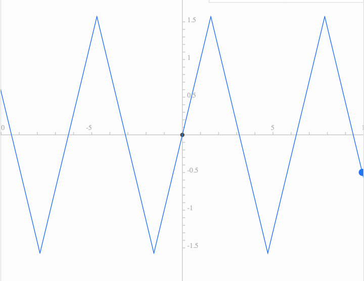

# D

最近在考研

关于高等数学中 **连续**、**可导**、**可微**，以及**导函数存在**等 之间的一些关系

## 一元函数

### 连续

$$
\displaylines{\lim_{\Delta x\to0}\Delta y=\lim_{\Delta x\to0}[f(x+x_0)-f(x_0)]\\
\lim_{\Delta x\to0}f(x)=f(x_0)\\
\forall \epsilon>0,\ \exists\delta>0,|x-x_0|<\delta,|f(x)-f(x_0)|<\epsilon}
$$

### 可导

$$
f'(x_0)=\lim_{\Delta x\to0}\frac{\Delta y}{\Delta x}=\frac{f(x_0+\Delta x)-f(x_0)}{\Delta x}
$$

### 可微

$$
\displaylines{\Delta y=A\Delta x+o(\Delta x)\\
\text dy=A\Delta x}
$$

### 关系

* 可导一定连续 **连续不一定可导**
* 可导的**充要条件**是$f’_-(x_0)$与$f’_+(x_0)$存在且相等
* 可导和可微是**充要条件**
* $\lim_{x\to x_0}f'(x)$存在(导函数连续) 则一定可导 但**可导$\lim_{x\to x_0}f'(x)$不一定存在**
* $f’_-(x_0)$与$f’_+(x_0)$存在则一定连续 但**连续不能推出$f’_-(x_0)$与$f’_+(x_0)$一定存在**
* $\lim_{x\to x_0}f'_-(x_0)$与$\lim_{x\to x_0}f'_+(x_0)$存在 **不一定连续**
* 可导 不能推出$\lim_{x\to x_0}f'_-(x_0)$与$\lim_{x\to x_0}f'_+(x_0)$存在

## 多元函数

### 连续

$$
\lim_{\begin{aligned}x\to x_0\\y\to y_0 \end{aligned}}f(x,y)=f(x_0,y_0)\\
$$

### 偏导数

$$
\displaylines{f'_x(x_0,y_0)=\lim_{\Delta x\to0}\frac{f(x_0+\Delta x,y_0)-f(x_0,y_0)}{\Delta x}=\frac {\text{d}}{\text{d}x}f(x,y_0)\big|_{x=x_0}\\
f'_y(x_0,y_0)=\lim_{\Delta y\to0}\frac{f(x_0,y_0+\Delta y)-f(x_0,y_0)}{\Delta x}=\frac {\text{d}}{\text{d}x}f(x_0,y)\big|_{y=y_0}}
$$

### 全微分

$$
\displaylines{\Delta z=f(x_0+\Delta x,y_0+\Delta y)-f(x_0,y_0)=A\Delta x+B\Delta y+o(\rho)&\rho=\sqrt{\Delta x^2+\Delta y^2}\\
\text dz=A\Delta x+B\Delta y}
$$

### 关系

做的一些题考察的不是很多 只写了考察的一些关系

* 连续说的是**多个方向的极限都存在** 单个无法推连续
* 连续和一阶偏导数存在 **没有关系** 无法互推
* 可微一定连续 **连续不一定可微**
* 一阶偏导数连续则可微 这是可微的**充分条件**
* 可微则一阶偏导数存在 这是可微的**必要条件**
* 也就是说 一阶偏导数连续 那么一阶偏导数就存在 这是比较显然的
* 这里的“可导”表示**一阶偏导数存在**

---

补充一个概念：$\arcsin (\sin x)\neq x$

做图可得

要看你在$\theta$的范围 超过$[-\frac \pi2,\frac\pi2]$就要换了 

比如这样
$$
\int_{\frac{3 \pi}{4}}^\pi \arcsin \frac{r}{2}\bigg|_0 ^{2 \sin \theta} \mathrm{d} \theta =\int_{\frac{3 \pi}{4}}^\pi(\pi-\theta) \mathrm{d} \theta=\frac{\pi^2}{32}
$$
