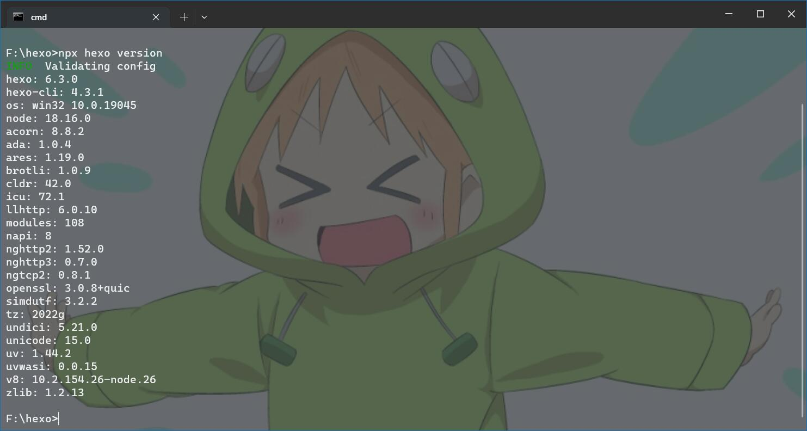
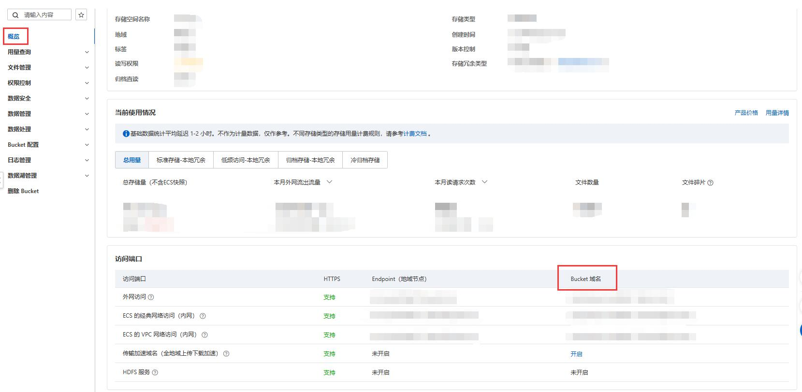
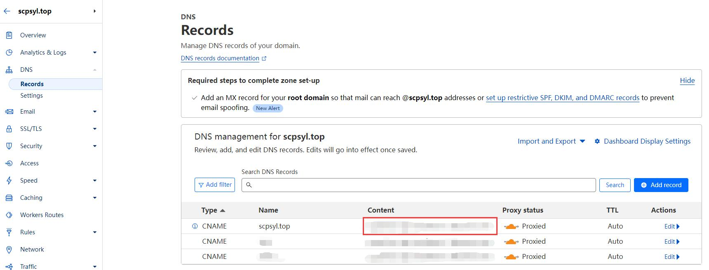
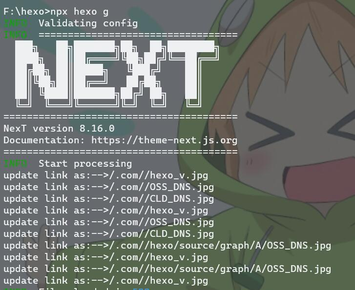
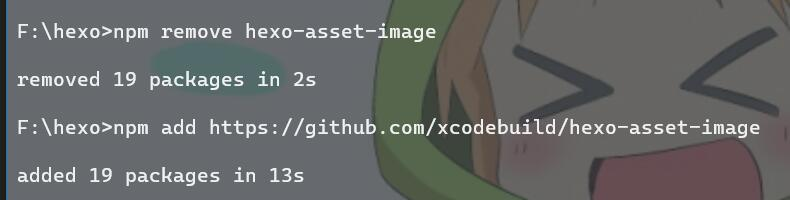
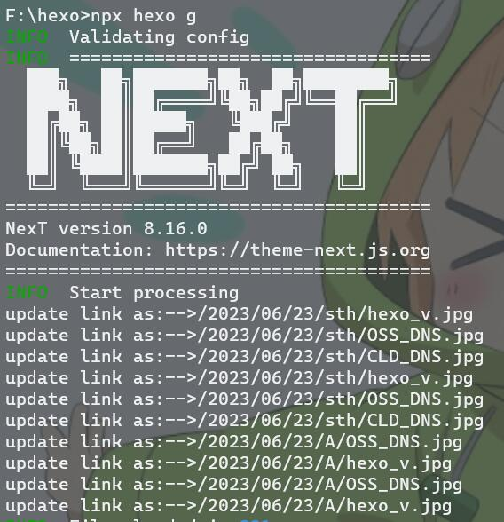
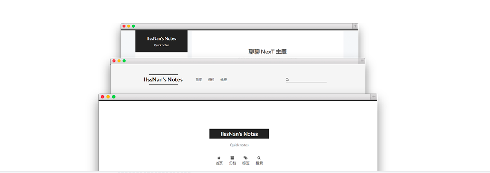
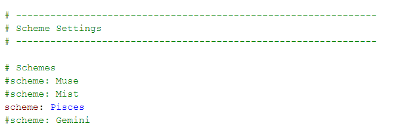

# hexo + Aliyun OSS + CloudFlare

本着造福他人的天性 在成功配好之后 写一个hexo+阿里云OSS Bucket 实现静态页面显示的mini教程 并且实现使用CLoudFlare来作为安全托管 而不是阿里云的 

这里主要写几个配环境时被卡住的点

## hexo初始化

关于hexo初始化的部分可以详见这一篇[hexo 安装](https://zhuanlan.zhihu.com/p/26625249) 主要就是下载node.js 并通过其安装hexo 

这里建议只采纳其关于hexo的安装部分

注意 最新版本的hexo命令 需要输入`npx hexo `来执行指令(这个在官方最新版的文档里面有写到) 配好后大致效果如下



然后在上传的时候 大致步骤就是 要先`npx hexo g`生成静态页面 然后在`npx hexo s` 先预览一下 这个时候你直接修改本地文件 远端是可以刷新的(但要手动刷新) 确认后再`npx hexo d`传上去 一段时间之后(大概1min) 刷新一下就可以了

## OSS初始化

关于OSS使用可以详见这篇[OSS基础配置](https://blog.csdn.net/scoful/article/details/103904864) 使用其的主要原因是个人的静态页面都比较轻量 最便宜的服务器也用不完(

注意 在DNS解析部分 使用`CNAME`做DNS解析的部分 主机域名要和你OSS部分阿里云给你提供的域名相对应 具体对应见下图  **概览**下 标注部分的第一项 即 **外网访问**对应的域名



这里推荐一个图形化界面看oss存储文件的软件 `oss browser` 提供私钥进行托管 当然也可以直接登陆阿里云平台来进行查看

腾讯云的oss也是同理的

## CloudFlare

关于CloudFlare解析的部分详见这篇[Cloudflare 入门教程](https://zhuanlan.zhihu.com/p/97389072) 

用CloudFlare的另一个好处就是 你配ssl证书的时候 就可以不依赖于服务器的托管来修改 之前就是使用服务器作为页面的托管 用putty做的互传 非常麻烦 证书也不是很安全

使用CloudFlare的话 上一步你做DNS解析的部分 就不要在阿里云处做解析了 在CloudFlare做解析时还是用OSS提供的域名 主机就如下了



主要就是这个content处的主机域名找对 否则一般会报一个DNS的err

这几个点注意到了 按照整个流程走一遍的话 应该就可以正常显示了

## Images

关于图像显示的部分 直接通过`npm install hexo-asset-image`的话 你上传图片 对应的图片在OSS里面看的路径和你的实际路径是不一致的 也就是会出现这样的情况(我采用的相对路径 这个和路径其实关系不大)



此时正确的解决方法是 把这个卸掉 然后用这个链接的去下载最新的插件

```html
https://github.com/xcodebuild/hexo-asset-image
```

也就是这样



注意 这个插件很多仓库里都有 网上有的版本的仓库可能不是这个 建议自己直接搜`hexo-asset-image`找到对应的仓库`add`一下就可以了

然后重新上传一下 直到出现这样的提示信息 和你在oss里面的目录相对应 就表示可以了



这也就是你能看到这些图片的原因(

## Beautify

关于美化的部分 使用NexT主题的可以详见这篇教程 教的很详细  [hexo NexT主题美化总结](https://www.mickeymiao.top/posts/f9b8ceb/) 

需要注意的是分清`hexo`的`_config.yaml`和`next`的`_config.yaml`

关于NexT的主题 有如下几种可选的格式 



通过在NexT主题下的`_config.yml`中`Scheme`块 进行选择性注释来修改 



---
