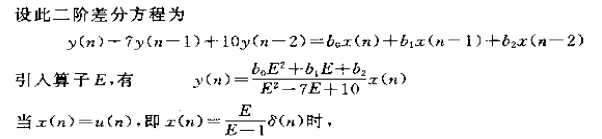

* 以下内容来源于 **郑君里《信号与系统》**

# 算子法

算子法 介于经典时域和频域变换之间的过渡带

## 算子表示法

### 连续域算子

$$
p=\frac d{dt}
$$

### 离散域算子 

也称 “移序算子” 本质为$\frac 1E$
$$
y(n+1)=Ey(n)
$$

## 传输算子

本质是利用算子符号 简写微分或差分的过程

### 连续域传输算子

$$
\displaylines{D(p)[r(t)]=N(p)[e(t)]\\
H(p)=\frac{N(p)}{D(p)}}
$$

用来求解零状态响应的$h(t)$或$g(t)$提供方便

#### 部分常用结论

这些是做题遇到的 证明略
$$
\displaylines{Ae^{-\alpha t}u(t)\Leftrightarrow \frac A{p+\alpha}\delta(t)\\
\frac A{\alpha-\beta}(e^{-\beta t}-e^{-\alpha t})u(t)\Leftrightarrow \frac A{(p+\alpha)(p+\beta)}\delta(t)\\
[H(p)\delta(t)]e^{-\alpha t}=H(p+\alpha)\delta(t)}
$$

### 离散域传输算子

$$
\displaylines{D(\frac 1E)[r(n)]=N(\frac 1E)[e(n)]\\
H(\frac 1E)=\frac{D(\frac 1E)}{N(\frac 1E)}}
$$

#### 部分常用结论

$$
\displaylines{u(n)\Leftrightarrow\frac E{E-1}\delta(n)\\
f(b)\cdot\alpha^nu(n)\Leftrightarrow\frac{f(b)\cdot E}{E-\alpha}\delta(n)
}
$$

来源于郑书课后题7-20的解析

这里仅给出第一个的证明

本质为 **任意信号由单位样值信号表出的形式**
$$
x(n) = \sum_{k = -\infty}^{\infty} x(k) \cdot \delta(n - k)
$$
原方程E算子形式变为离散时域形式
$$
\displaylines{x(n)=\frac 1{1-\frac 1E}\delta(n)\\
x(n)-x(n-1)=\delta(n)}
$$
通过迭代法 并假设$x(n)=0, \ n<0$即因果的 则有$x(n)=u(n)$成立

$$

$$
$\mathscr{L}^{-1}\left\{(s \mathbf{I}-\mathbf{A})^{-1}\right\}=\mathrm{e}^{\mathbf{A} t}$

